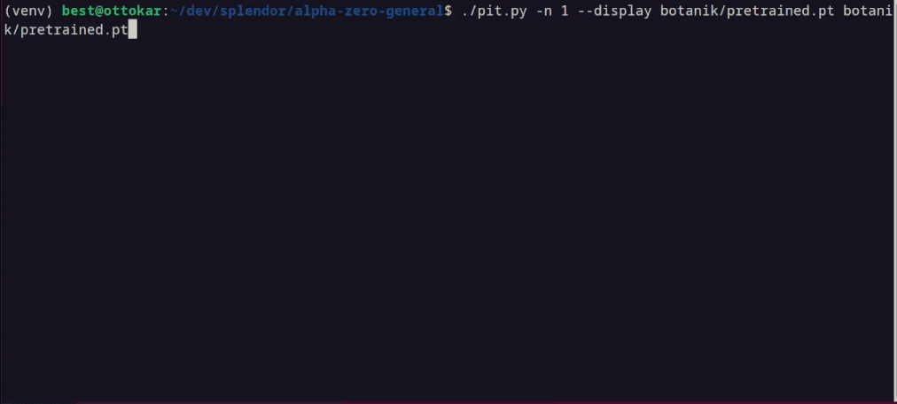
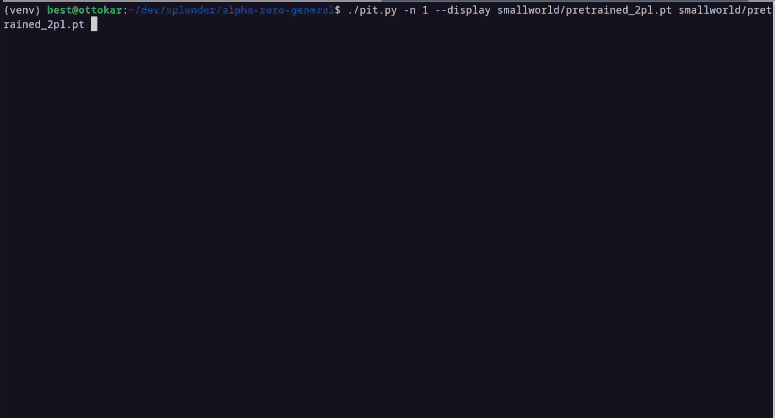

# CPU-optimized Alpha Zero General (any game, any framework!)

Based on the superb repo https://github.com/suragnair/alpha-zero-general but with higher strength, optimized for
CPU-only 25-100x speed improvement, and supporting 2+ players games. You can play with it on your
browser https://github.com/cestpasphoto/cestpasphoto.github.io. Technical details about the improvements are listed in
this [page](README_features.md).

October 2024: I (PJF98) have added Azul to this framework (for 2 players only currently). I have also trained a reasonably
strong ai for the 2 player game. I want to say thanks to all those who worked on the previous repo's, particulary cestpasphoto,
I learnt a lot from his existing code.

## Supported games

* [Azul](#azul)
* [Botanik](#botanik)
* [Machi Koro (a.k.a. Minivilles)](#machi-koro--minivilles)
* [Santorini (with basic gods)](#santorini)
* [Small World](#small-world)
* [Splendor](#splendor)
* [The Little Prince - Make me a planet](#the-little-prince---make-me-a-planet)

### Azul

2 player Azul has been added to the framework and a reasonably strong ai has been trained for the 2 player version. I would
love for it to get stronger though!

### Splendor


* [x] Support of [Splendor game](https://en.wikipedia.org/wiki/Splendor_(game)) with 2 players
* [x] Support of 3-4 players (just change NUMBER_PLAYERS constant)
* [x] Proper MCTS handling of "chance" factor when revealing new deck card
* [x] Adding "universe exploration" feature for even better training
* [x] Added pretrained models for 2-3-4 players

The AI engine doesn't know which cards will be drawn. There is one limitation: implemented logic doesn't allow you to
both take gems from the bank and give back some (whereas allowed in real rules), you are limited to either take 1-2-3
gems or give back 1-2 gems.

### Machi Koro / Minivilles

* [x] Quick implementation of [Minivilles](https://en.wikipedia.org/wiki/Machi_Koro), with handful limitations


### The Little Prince - Make me a planet

* [x] Quick implementation
  of [The little prince](https://cdn.1j1ju.com/medias/67/f8/eb-the-little-prince-make-me-a-planet-rulebook.pdf), with
  limitations. Main ones are:
    * No support of 2 players, only 3-5 players are supported
    * When market is empty, current player doesn't decide card type, it is randomly chosen.
    * Grey sheeps are displayed on console using grey wolf emoji, and brown sheeps are displayed using a brown goat.

### Santorini

* [x] Own implementation of [Santorini](https://www.ultraboardgames.com/santorini/game-rules.php), policy for initial
  status is user switchable (predefined, random or chosen by players)
* [x] Support of goddess (basic ones only)


About 90+% winrate against [Ai Ai](http://mrraow.com/index.php/aiai-home/aiai/) and 95+% win rate
against [BoardSpace AI](https://www.boardspace.net/english/index.shtml). See [more details here](santorini/README.md)

### Botanik

* [x] Support of [Botanik](https://boardgamegeek.com/boardgame/271529/botanik) with 2 players
* [x] Machine size is limited to 7x7, which should be enough in most cases



### Small World

* [x] Support of [Small World](https://boardgamegeek.com/boardgame/40692/small-world) with 2 to 5 players
* [x] All types of people and power from the original game are supported. Each turn of a player may need several
  actions (see code for more details).
* [x] Extra effort to improve pretrained model for 2 players

 (Scores are on the 2 last rows after _sc=_, and number after
_#_ is number of next round).


---

## Installation

Contrary to the repo this repo is based on, this one doesn't set up a Docker. Just launch the Python scripts from your
PC, no special GPU support required.

### Dependencies

```
pip3 install onnxruntime onnx numba tqdm colorama coloredlogs
pip3 install torch torchvision --extra-index-url https://download.pytorch.org/whl/cpu
```

## Running the code

### Train the model

Use `main.py` with your parameters, e.g.:

`python main.py splendor -m 800 -f 0.1 -l 0.0003 -D 0.3 -C ../results/mytest -V 74`

### How to play versus saved engine

Launch `pit.py` with the name of the game and the name of the two players.

`python /pit.py splendor splendor/pretrained_2players.pt splendor/pretrained_2players.pt -n 1 --display`
or
`python ./pit.py splendor splendor/pretrained_2players.pt human -n 1`


You can run more than 1 game at a time and just display the game results 
Contrary to baseline version, pit.py automatically retrieves training settings and load them (numMCTSSims,
num_channels, ...) although you can override if you want; you may even select 2 different architecture to compare
them!

### Advanced details

#### Recommended settings for training

Compared to initial version, I target a smaller network but more MCTS simulations allowing to see further: this approach
is less efficient on GPU, but similar on CPU and allow stronger AI.

`main.py -m 800 -e 1000 -i 5 -F -c 2.5 -f 0.1 -T 10 -b 32 -l 0.0003 -p 1 -D 0.3 -C ../results/mytest -V 74`: 

* Start by defining proper number of players in SplendorGame.py and disabling card reserve actions in first lines of
  splendor/SplendorLogicNumba.py
* `-c 2.5 -f 0.1`: MCTS options to tune, like cpuct value and FPU (first play urgency)
* Initiate training with lower simulations number and less episodes per round
* `-b 32 -l 0.0003 -p 1 -D 0.3`: define batch size, learning rate, number of epochs and dropout. Larger number of epochs may degrade performance, same for larger batch sizes so you only need to tune roughly dropout value (0., 0.3 or 0.3).
* `-V 74`: define NN architecture to use. The specified NN architecture must be listed in splendor/splendorNNet.py (look at `forward()` function). 

My baseline of training scenario is the following:

1. `-m 100 -q 0. -l 0.003 -e 200 -i 2 -f 0.1`
2. `-m 200 -q 0.5 -l 0.001 -e 200 -i 4 -f 0.1`
3. `-m 400 -q 0.5 -l 0.0003 -e 500 -i 8 -F -f 0.1`
4. `-m 800 -q 1.0 -l 0.0003 -e 1500 -i 10 -F -f 0.1`


Of course you need to tune parameters depending on the game, especially cpuct and FPU.
If you specify a previous checkpoint using a different architecture (`-V` option), it will do its best by training such new architecture based on examples of previous checkpoint. It allows me starting first steps of training with small/fast networks and then experimenting larger networks.

#### To debug

To debug add `NUMBA_DISABLE_JIT=1` as a prefix before main.py, and the option `--debug`.

#### Multithreading

I also usually execute several trainings in parallel; you can evaluate the results obtained in the last 24 hours by
using this command (execute as many times as threads): `./pit.py -A 24 -T 8`

The code also runs several games to benefit from faster batch inferences; note that games are not run simultaneously but
one at a time, meaning it still uses 1 CPU core. The downside is the bigger memory footprint.

#### HyperParameter Optimisation
You can use Ray to run HPO (especially Population Based Training "PBT"). This is still new so it may change but currently process is to configure first `rayConfig.py` and `useRay.py`, then call the latest.
