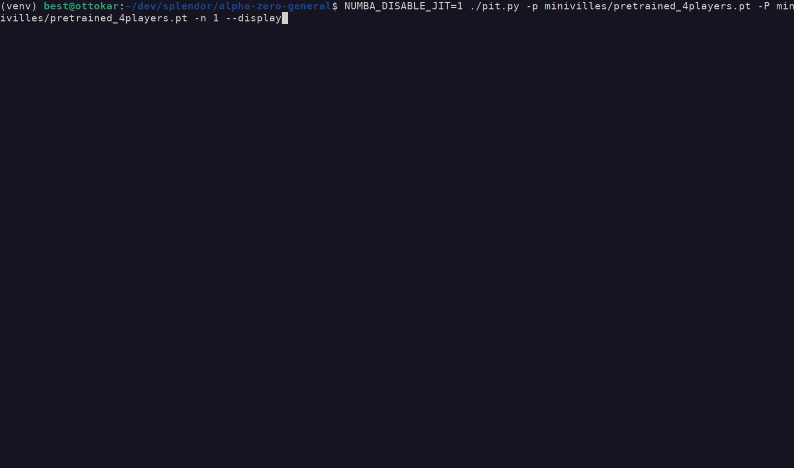
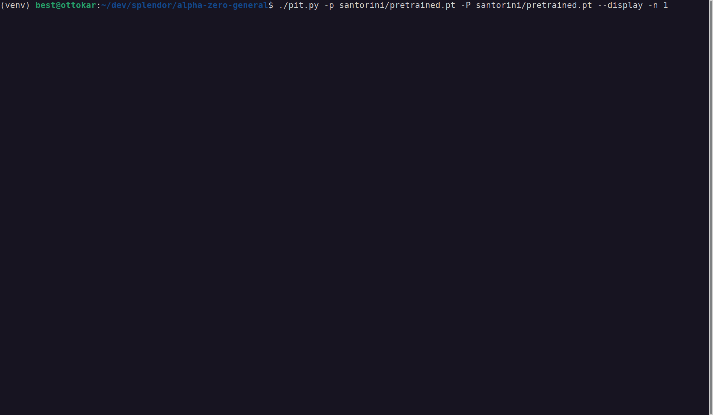
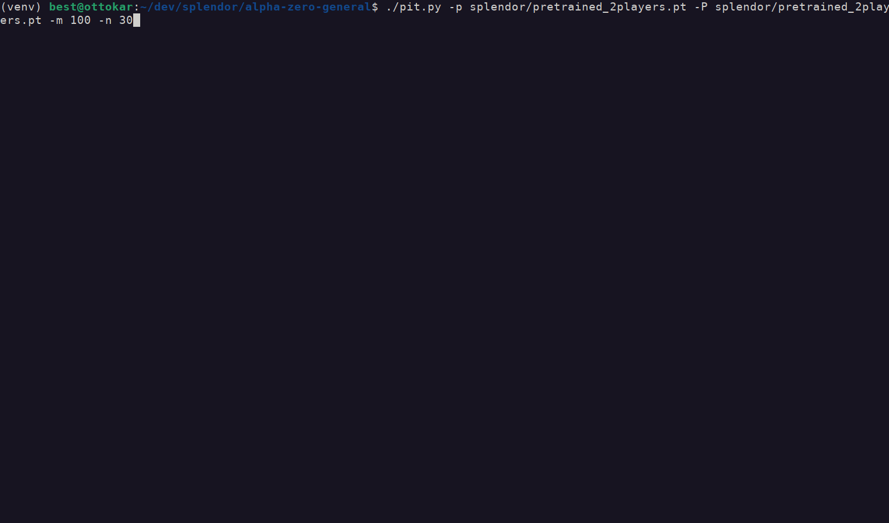
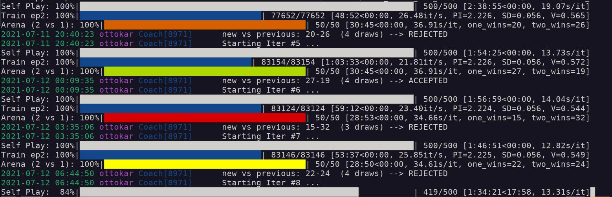

# My Alpha Zero General (any game, any framework!)

Based on the superb repo https://github.com/suragnair/alpha-zero-general but support games with more than 2 players, proper support of invalid actions, and 25-100x speed improvement.

### Added Features

  
Click here to see details in this section

  * [x] Added Dirichlet Noise as per original [DeepMind paper](https://www.nature.com/articles/nature24270.epdf), using this [pull request](https://github.com/suragnair/alpha-zero-general/pull/186)
  * [x] Compute policy gradients properly when some actions are invalid based on [A Closer Look at Invalid Action Masking inPolicy Gradient Algorithms](https://arxiv.org/pdf/2006.14171.pdf) and its [repo](https://github.com/vwxyzjn/invalid-action-masking)
  * [x] Support games with **more than 2 players**
  * [x] Speed optimized
    * [x] Reaching **about 3000 rollouts/sec on 1 CPU core** without batching and without GPU, meaning 1 full game in 30 seconds when using 1600 rollouts for each move. All in all, that is a 25x to 100x speed improvement compared to initial repo, see [details here](santorini/README.md).
    * [x] Neural Network inference speed and especially latency improved, thanks to ONNX 
    * [x] MCTS and logic optimized thanks to Numba, NN inference is now >80% time spent during self-plays based on profilers
  * [x] Memory optimized with minimal performance impact
    * [x] use of in-memory compression 
    * [x] regularly clean old nodes in MCTS tree
  * [x] Algorithm improvements based on [Accelerating Self-Play Learning in Go](https://arxiv.org/pdf/1902.10565.pdf)
    * [x] Playout Cap Randomization
    * [x] Forced Playouts and Policy Target Pruning
    * [x] Global Pooling
    * [ ] Auxiliary Policy Targets
    * [x] Score Targets

  Others changes: improved prints (logging, tqdm, colored bards depending on current Arena results) and parameters can be set in cmdline (added new parameters like time limit). Still todo: set up HyperParameters Optimization (like Hyperband or Population-Based Traininginclude), and ELO-like ranking

  Supported games: Splendor, The Little Prince - Make me a planet, Machi Koro (Minivilles), Santorini with basic gods

### Splendor

* [x] Support of [Splendor game](https://en.wikipedia.org/wiki/Splendor_(game)) with 2 players
* [x] Support of 3-4 players (just change NUMBER_PLAYERS in main.py)
* [x] Proper MCTS handling of "chance" factor when revealing new deck card
* [x] Optimized implementation of Splendor, thanks to Numba
* [x] Explore various architectures
* [x] Added pretrained models for 2-3-4 players

There are some limitations: implemented logic doesn't allow you to both take gems from the bank and give back some (whereas allowed in real rules), you can either 1-2-3 gems or give back 1-2 gems.

### Machi Koro / Minivilles
* [x] Quick implementation of [Minivilles](https://en.wikipedia.org/wiki/Machi_Koro), with handful limitations

### The Little Prince - Make me a planet
* [ ] Quick implementation of [The little prince](https://cdn.1j1ju.com/medias/67/f8/eb-the-little-prince-make-me-a-planet-rulebook.pdf), with limitations. Main ones are:
   * No support of 2 players, only 3-5 players are supported
   * When market is empty, current player doesn't decide card type, it is randomly chosen.
   * Grey sheeps are displayed on console using grey wolf emoji, and brown sheeps are displayed using a brown goat.

### Santorini
* [x] Own implementation of [Santorini](https://www.ultraboardgames.com/santorini/game-rules.php), policy for initial status is user switchable (predefined, random or chosen by players)
* [x] Optimized implementation, thanks to Numba again
* [x] Support of goddess (basic only)
* [x] Explore various architectures, max pooling in addition to 2d convolutions seems to help

---

## Technical details

  
Click here for details about training, running or playing

  #### Dependencies
  `pip3 install onnxruntime-noopenmp numba tqdm colorama coloredlogs`
  and
  `pip3 install torch==1.8.1+cpu -f https://download.pytorch.org/whl/torch_stable.html`

  The noopenmp version of onnxruntime is faster for single thread execution. This is the recommended way for fast exploration of hyperparameters, using several threads.

  #### How to play versus saved engine
  `./pit.py -p splendor/pretrained_2players.pt -P human -n 1`

  Switch -p and -P options if human wants to be first player. You can also make 2 networks fight each other.
  . Contrary to baseline version, pit.py automatically retrieves training settings and load them (numMCTSSims, num_channels, ...) although you can override if you want; you may even select 2 different architecture to compare them!

  #### Recommended settings for training
  `main.py -m 1600 -v 15 -T 30 -e 500 -i 5 -p 2 -d 0.50 -b 32 -l 0.0003 --updateThreshold 0.55 -C ../results/mytest`:

  * Start by defining proper number of players in SplendorGame.py and disabling card reserve actions in first lines of splendor/SplendorLogicNumba.py
  * `-v 15`: define loss weights of value estimation vs policy, higher mean more weights to value loss. Suraganair value of 1 lead to very bad performance, I had good results with `-v 30` during first iterations, and then decrease it down to `-v 10`
  * `-b 32 -l 0.0003 -p 2`: define batch size, learning rate and number of epochs. Larger number of epochs degrades performance, same for larger batch sizes
  * `--updateThreshold 0.55`: result of iteration is kept if winning ratio in self-play is above this threshold. Suraganair value of 60% win seems too high to me

  

  The option `-V` allows you to switch between different NN architectures. If you specify a previous checkpoint using a different architecture, it will still try loading weights as much as possible. It allows me starting first steps of training with small/fast networks and then I experiment larger networks. I also usually execute several trainings in parallel; you can evaluate the results obtained in the last 24 hours by using this command (execute as many times as threads): `./pit.py -A 24 -T 8`

  I usually stop training when the 5 last iterations (or `-i` value) were rejected.

  Use of forced rollouts, surprise weight, cyclic learning rate or tuning cpuct value hadn't lead to any significant improvement.

