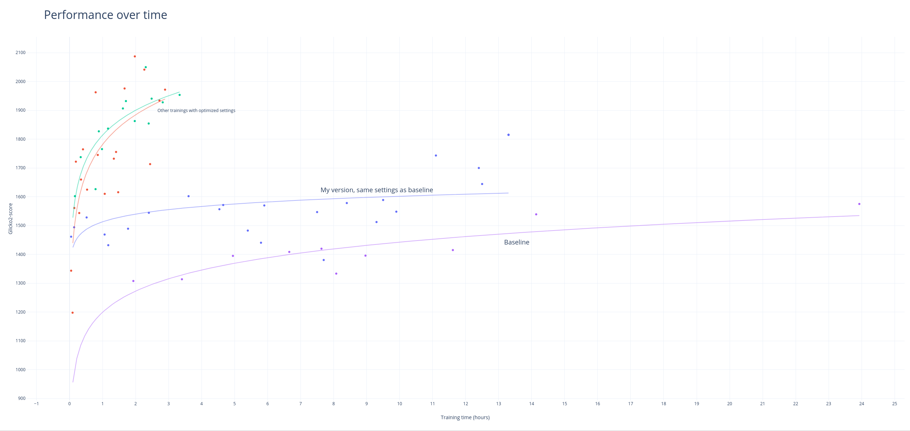

# Speed comparison between baseline and my fork

After implementing my fork, I wanted to do a comparison versus baseline repo. I have used the only game supported by both baseline and my fork, Santorini. You can test it in the browser versionon  https://github.com/cestpasphoto/cestpasphoto.github.io.

### Training params

All training use same computer (i5-9400, no GPU). Baseline code uses tensorflow on all CPU cores, my version uses pytorch + numba on a single CPU core.

##### Baseline

First I've used baseline code as is (just changed game to Santorini). But it didn't accepted any model in the first 12 hours. Tried again with num_channels=256 but same result.
So I've modified more settings, ran it for 24 hours and it did converged:
* Network
  * num_channels = 32
  * lr = 0.0003
  * batch_size = 32
  * epochs = 5
  * dropout = 0.15
* MCTS
  * numMCTSSims = 75

##### My version

On my version of code, I have used same settings as last training on baseline (committed architecture "-V 13"). Couple of differences though: my network has 3 outputs whereas baseline only has 2.

And since such training uses a single CPU core, I was able to run other trainings simultaneously: both using other architecture (-V 11), lower nb of epochs (2 instead of 5) and 200 & 400 as numMCTSSims. For these I used random initialization.

### How to rate each checkpoint?

As I know of, there is no standard process to rate lots of checkpoints. Running 1000 games for each possible pair of checkpoints would have been to computational intensive.
Instead, I have organised the following "tournament":
* rated random player + 3 main checkpoints (1000 games for each pair)
* assigned them a rating score based on the results
* rated all others checkpoints with 100 games for each of them versus the 3 main checkpoints
* assigned such checkpoints a score based on these new results and the ratings of 3 main checkpoints

As a score, I have used [glicko2](https://en.wikipedia.org/wiki/Glicko_rating_system) which is similar to ELO but better. Roughly, difference of 100 in glicko2 score means 90% chance winning, 200 means 99% chance...

This score and the overall process may not be the best one, but it still gives an idea on how well each training performed and how fast it learned.

### The results

For reference, glicko score of random player is 843 ± 110 and the pretrained model I commited is 2249 ± 95.

Using similar settings as baseline, my version achieve **similar results in 25x less time**: level of glicko2=1500 is achieved in 17 hours for baseline, whereas my version achieve it in about 0.7 hour. Furthermore, other settings lead to similar performance in about 10 minutes, meaning 100x faster!

And all of that in python language, no C.

Compared to other AI I found (using no god power, other AI always starting first, my AI choose random player position)
* about 70% winrate against [Ai Ai](http://mrraow.com/index.php/aiai-home/aiai/), set with a timelimit of 10sec/move + 10sec/build
* 90+% win rate against [BoardSpace AI](https://www.boardspace.net/english/index.shtml), using BestBot
